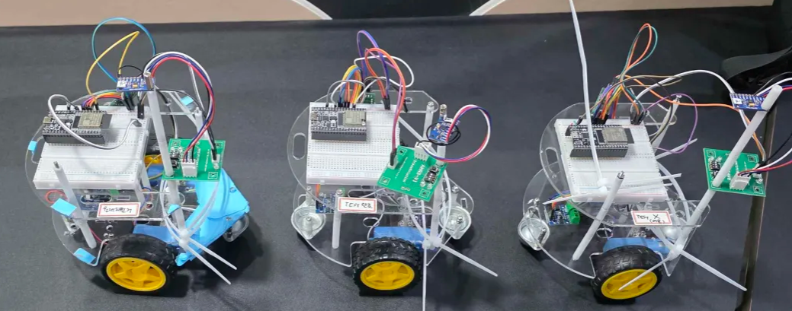
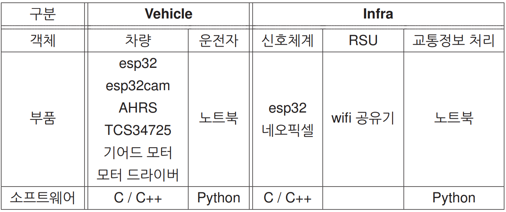
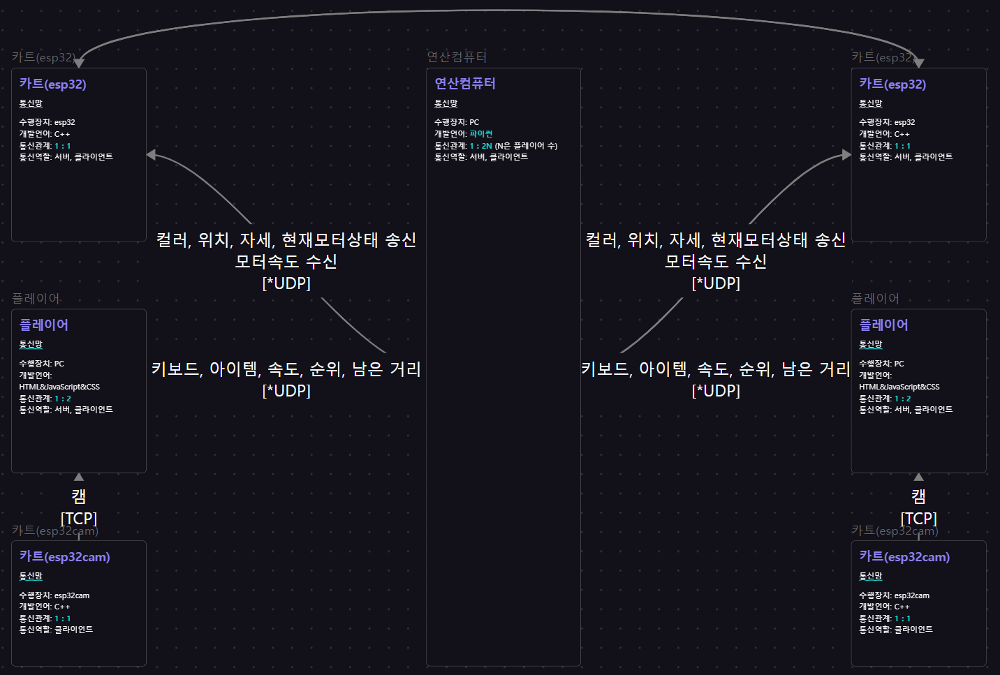

### 1. **프로젝트 요약**

기존의 UDP를 일부 보완하여 차량, 인프라 등의 객체가 통신할 수 있는 체계를 만들고, 이 환경에서 차량들이 서로 주행 데이터를 공유하고 재현할 수 있는 알고리즘을 설계하고자 한다.

더욱 자세한 내용과 개발 과정은 아래 노션 링크를 통해 확인할 수 있습니다.
[https://www.notion.so/Team-Serpente-24750ea4281e8071b4e6f1e664ec102f?source=copy_link](https://www.notion.so/Team-Serpente-24750ea4281e8071b4e6f1e664ec102f?pvs=21)

### 2. **핵심 기능(Features) 요약**

- 클래스를 이용한 다중 카트 연결 가능
- 3Way-Handshake를 이용한 통신 연결 확인
- 편차 제곱의 합을 이용한 컬러센서 색상 보정
- 모터 편차 조정
- 리플레이 모드
- esp32cam을 통한 카트 시점 제공

### 3. **프로젝트 구조도**

### 4. **실행 방법**

| 주요 전자부품 | 기타 부품 |
| --------- | ---------- |
| SP32(1개)   tcs34725(1개)   AHRS(1개)   모터 메탈 기어박스 1:90(2개)   L9110s 모터 드라이버(1개) | 바퀴(2개)   볼바퀴(2개)   아크릴 레이어   지지대 볼트   볼바퀴   보조배터리     5핀 케이블 |

---

- 사용하고자하는 카트와 공유기 한 대를 준비한다(핫스팟도 사용가능).
- 사용할 카트의 수 + 1 만큼의 와이파이를 연결할 수 있고 코드 실행이 가능한 노트북/컴퓨터를 준비한다.
- 연산 컴퓨터 역할을 할 노트북/컴퓨터에 PC_UNO_Operator코드를 실행한다.
- 카트의 경우에는 KART_ESP_Main코드를 업로드하고 AHRS를 캘리브레이션 해야한다.
- 각 카트에 대응되는 노트북/컴퓨터에 PC_DUO_User코드를 넣는다.
- KART_ESP_Main코드의 경우에는 사용하는 와이파이의 이름과 비밀번호를 변경해야한다.
- 나머지 노트북/컴퓨터도 공유기에 연결하여 ip를 확인한다.
- 확인한 ip를 바탕으로 각 객체에서 통신 대상의 ip로 변경한다.
- 모든 코드를 실행하면 연산컴퓨터를 통해 연결 여부를 알 수 있으며 연결 후에는 플레이어가 w, a, s, d, space, =, `를 사용하여 카트가 움직임 및 기능을 수행할 수 있다.
- 연산컴퓨터에서 코드가 종료될 경우 모든 플레이어의 입력 데이터가 csv파일 형태로 저장된다.